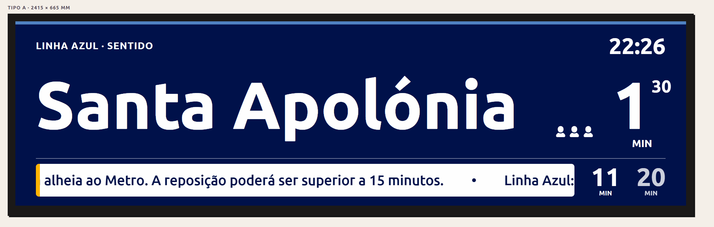

# Lisbon Metro · Passenger Information Display

**[metro.lixo.dev](https://metro.lixo.dev)**



---

## The story

Lisbon Metro began replacing the passenger information displays on its platforms — panels that had been in use for decades — with new modern screens. The problem: the new design fell short of expectations.

This project is an alternative proposal. A suggestion for what the new panels could look like: clear, functional, and with a visual identity worthy of a modern metropolitan network.

---

## Features

- Simulation of all four physical panel types (Type A–D)
- Live mode with real-time arrival data from the Lisbon Metro API
- Station and destination selectable manually or at random
- Line colour bar
- Clock, arrival times, and train occupancy (simulated)
- Alerts with animated marquee and message cycling
- Alerts, orientation (left/right), and language (PT/EN) toggles
- Light/dark theme
- Responsive design

## Panel types

| Type   | Dimensions (mm)  |
|--------|------------------|
| Type A | 2415 × 665 × 170 |
| Type B | 2500 × 560 × 260 |
| Type C | 2415 × 530 × 260 |
| Type D | 1420 × 390 × 160 |

---

## Development

```sh
npm install
npm run dev
```

```sh
npm run build
```

---

Built with [Astro](https://astro.build). Real-time data provided by the Lisbon Metro API, served by [abelhato](https://4belhato.trade).
